# NoteWorthy

NoteWorthy is a productive application inspired from Google Keeps. It lets you store your notes in the form of title, description as well as images.

## About

NoteWorthy is a full-stack application with its backend built in Java with Spring Boot and the frontend is native Android app made in Kotlin

## App Features

- **NOTES** - You can save all your frequently visited notes and access it from anywhere in the world.
- **IMAGES** - You can also save multiple images, view them in the app and download them if required later in time.
- **PRIORITY** - Assign priority(LOW, MEDIUM, HIGH) to your notes and sort them accordingly.
- **SEARCH** - Lost in your own notes? No problem! You can search your notes with the word you remember. Be it the title or description.

## Built With
* [Spring Boot](https://spring.io/projects/spring-boot) - Spring Boot is a framework that simplifies the development of Java applications, particularly web applications. It provides a streamlined way to create stand-alone, production-grade Spring-based applications with minimal configuration. Spring Boot offers a range of features including automatic configuration, embedded servers, and a robust ecosystem of libraries and plugins. It is widely adopted for building scalable and efficient Java web applications with ease.
* [Cloudinary](https://cloudinary.com/) - Cloudinary is a cloud-based media management platform that simplifies the process of uploading, managing, and delivering images and videos for web and mobile applications. It provides a comprehensive set of tools and APIs to handle tasks like image optimization, transformation, and delivery. With Cloudinary, developers can efficiently store and manipulate media assets, ensuring optimal performance and user experience. It is a popular choice for managing media assets in a scalable and reliable manner.
* [JWT (JSON Web Tokens)](https://jwt.io/) - JWT is an open standard for securely transmitting information between parties as a JSON object. It is commonly used for authentication and authorization purposes in web applications. JWT consists of three parts: a header, a payload, and a signature. The header contains metadata about the token, the payload carries the claims or information, and the signature is used to verify the integrity of the token. JWTs are self-contained, compact, and can be easily validated by the server without the need for database lookups. They provide a stateless and scalable approach to secure user authentication and data exchange in distributed systems.
* [Redis](https://redis.io/) - Redis is an open-source, in-memory data structure store that can be used as a database, cache, and message broker. It provides high-performance and low-latency data access by storing data in memory, making it ideal for use cases that require fast data retrieval. Redis supports various data structures such as strings, hashes, lists, sets, and sorted sets, along with powerful features like pub/sub messaging and transactions. It is widely used for caching, real-time analytics, session management, and other data-intensive applications.
* [Hibernate](https://hibernate.org/) - Hibernate is a popular open-source object-relational mapping (ORM) framework for Java applications. It simplifies the process of mapping Java objects to database tables, allowing developers to work with persistent data in an object-oriented manner. Hibernate handles the tasks of database interaction, data querying, and transaction management, abstracting the underlying database details. It provides a wide range of features, including automatic schema generation, caching, and lazy loading, to optimize performance and productivity. Hibernate is widely used in Java applications to facilitate database operations and improve development efficiency.
* [MySQL](https://www.mysql.com/) - MySQL is an open-source relational database management system (RDBMS) that provides a robust and scalable solution for storing and managing structured data. It offers a wide range of features including support for multiple storage engines, ACID-compliant transactions, and comprehensive SQL querying capabilities. MySQL is highly reliable, efficient, and widely used in various applications and industries. It is a popular choice for web applications, content management systems, data warehousing, and more, offering flexibility and scalability for handling data storage and retrieval needs.

## Project Architecture:
This app is built using [Model View ViewModel Architecture](https://developer.android.com/jetpack/docs/guide#recommended-app-arch)(MVVM).

## 📸 Screenshots 

|   |   |   |
|---|---|---|
|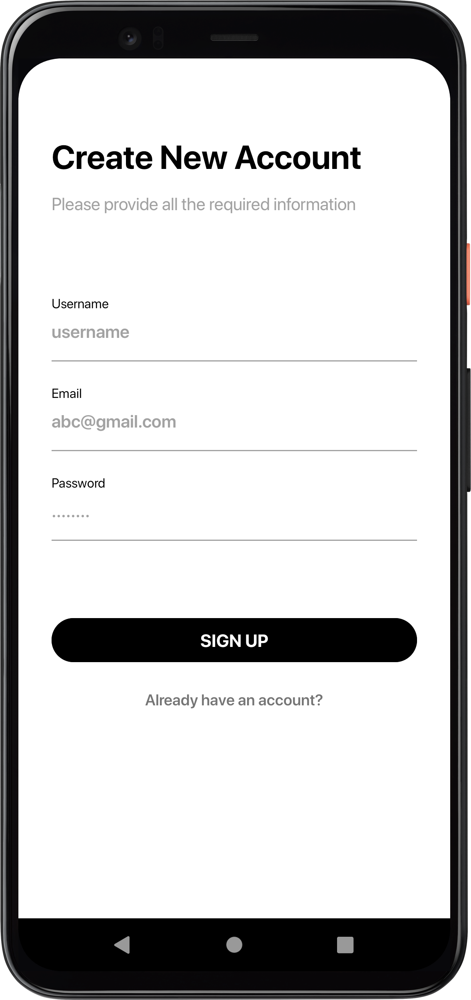| 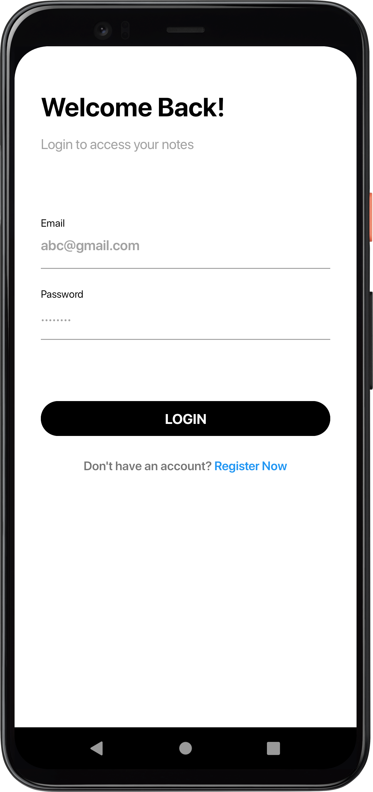 | 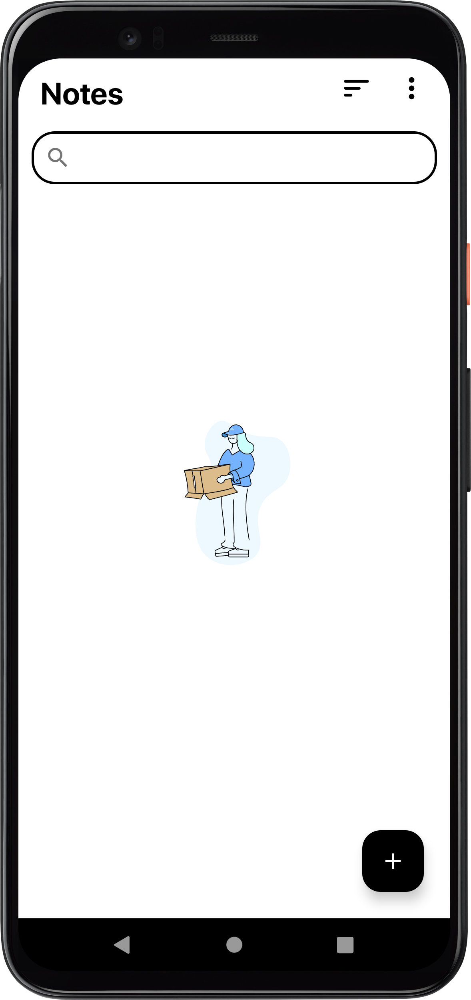
|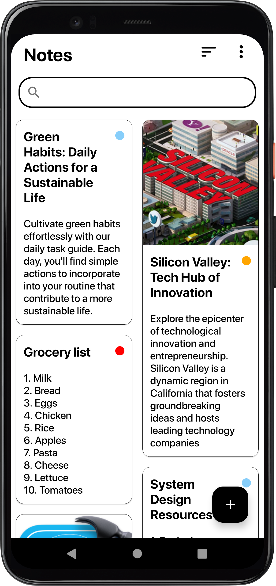 | 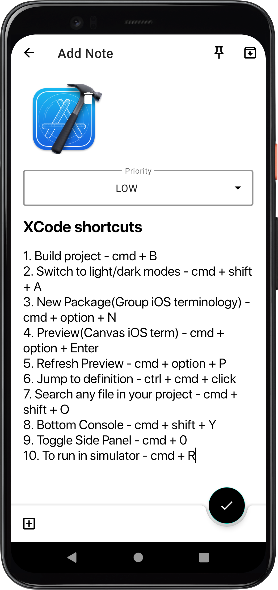 |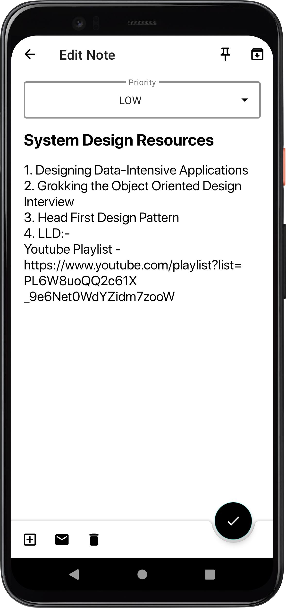 
|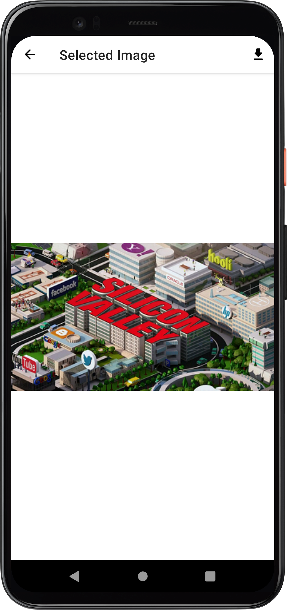|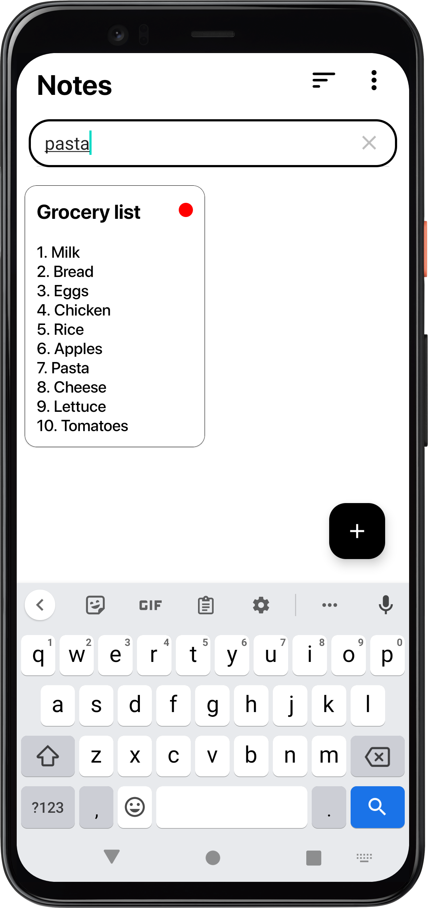 | 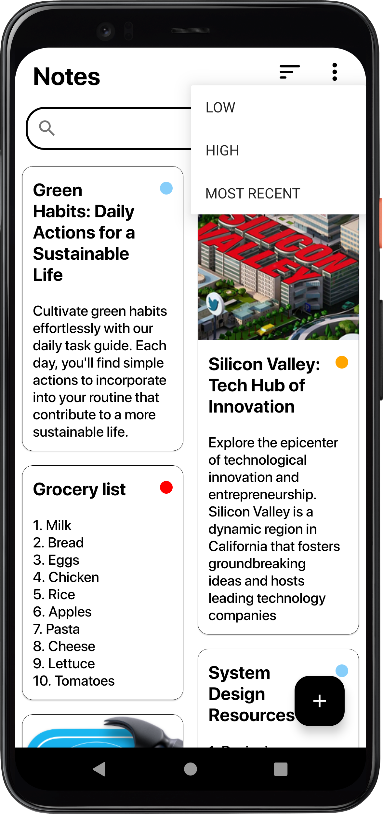
|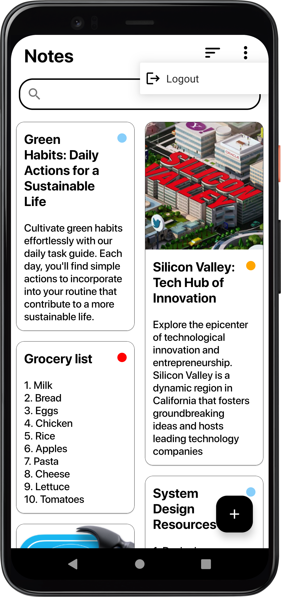

## High-level Design [Backend]

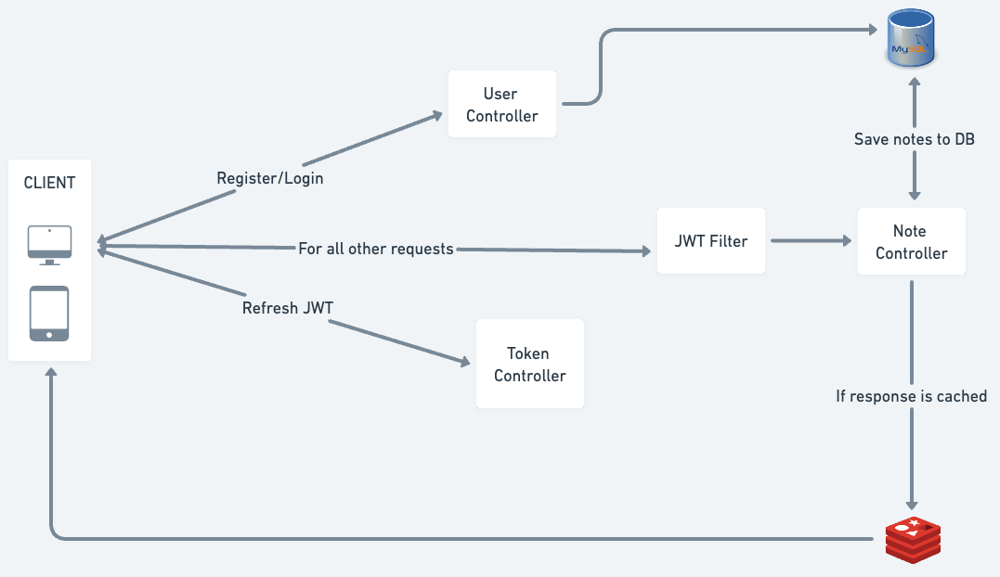

## Contact

For any queries, you can mail me at prathmeshkc2001@gmail.com

